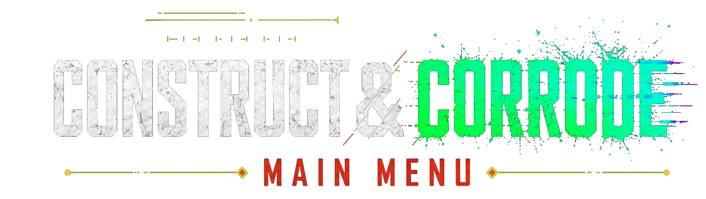
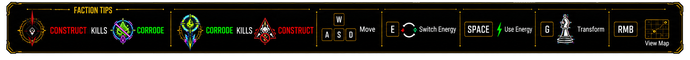

<a href="#中文版本"><strong>中文</strong></a>

# Construct & Corrode

> A step-based roguelite tactics game where every tile is a resource, every move advances the board, and every kill has to be prepared in a single decisive strike.

## Gameplay Overview

Construct & Corrode is a grid tactics roguelite built around short, readable decisions. You move one tile at a time through a chessboard dungeon, collect opposing Construct and Corrode power from the floor, reshape local terrain, lure enemies into friendly fire, and spend one-use chess-piece transformations to break the normal movement rules at the exact moment it matters.

The current playable baseline focuses on a vertical slice: procedural runs, fixed tutorial levels, HUD feedback, combat previews, audio hooks, menu flow, and run records for deepest floor and fastest arrival time.

## Media

These README links are already wired. Add the screenshots or GIFs to the paths shown here and the page will render them directly.

| Moment | Preview |
| --- | --- |
| Core loop: move, read threats, resolve turns |  |
| Terrain as resource: Construct, Corrode, minimal, and blocked tiles |  |
| Combat preview: threshold kills, enemy threat, and ranged lines |  |
| Chess-piece transformation: Knight, Bishop, Rook, and Queen movement |  |
| Procedural run: generated rooms, corridors, enemies, and rewards |  |

## Controls

| Input | Action |
| --- | --- |
| `W` `A` `S` `D` | Move one tile in four directions. |
| `E` | Switch the terrain conversion energy target. |
| `Space` | Use the current conversion energy. |
| `G` | Open the chess-piece transformation selection. |
| Right Mouse Button | View or drag the map. |

Faction reminder: Construct power kills Acid enemies, and Corrode power kills Construct enemies.

## Why It Works

- **One step, one consequence**: default movement is four-directional and step-based. A valid move or attack advances the turn, so positioning always matters.
- **Terrain is your economy**: Construct and Corrode tiles are not background dressing. They are how you build damage, control risk, prepare kills, and reshape the board.
- **Kills require commitment**: enemies do not take chip damage. You must meet their kill threshold in one action, turning combat into preparation, timing, and execution.
- **Enemy factions can be weapons**: Construct and Corrode enemies oppose each other. Ranged lines, collision rules, and faction immunity let you engineer clearing chains.
- **Special movement is rare and sharp**: one-use chess-piece forms let you leap, slide, cut diagonally, or strike across distance without replacing the core grid movement.

## How A Run Plays

1. Read the board: tile types, enemy factions, ranged aim lines, safe tiles, and your current Construct and Corrode values.
2. Choose an action: move, attack, convert nearby terrain, or spend a chess-piece transformation.
3. Resolve the result: collect tile power, trigger pickups, kill enemies if the threshold is met, or fall back if the attack fails.
4. Survive the enemy turn: melee enemies close in, ranged enemies aim and fire, and opposing factions can destroy each other.
5. Clear the floor: defeat every enemy to advance to the next generated level, with difficulty scaling by floor depth.

## Core Systems

| System | Player-facing role |
| --- | --- |
| Step-based turns | Every meaningful action pushes the tactical clock forward. |
| Construct and Corrode values | Your two opposing damage tracks and suppression routes. |
| Threshold kills | A target dies only when the correct non-immune damage reaches its threshold in one strike. |
| 3x3 terrain conversion | A limited board rewrite that changes resources and enemy collision outcomes. |
| Friendly fire | Ranged and collision interactions let enemies remove enemies when you set the board correctly. |
| Chess transformations | Consumable Knight, Bishop, Rook, and Queen movement options for tactical breakthroughs. |
| PCG run mode | L-System dungeon generation creates rooms, corridors, walls, starts, exits, enemies, and pickups. |
| Fixed tutorials | Six hand-authored lessons introduce tiles, kills, conversion, ranged fire, suppression, and transformations. |

## Current Scope

The current design baseline includes step-based movement, Construct/Corrode tile resources, enemy immunity, threshold kills, ranged enemies, friendly fire, 3x3 terrain conversion, HP pickups, chess-piece pickups, four transformation forms, procedural runs, six tutorial levels, combat preview, audio events, menus, and run records.

Longer-form story, permanent progression, shops, relics, bosses, elite enemies, exit-driven branching, and final balance curves are still future design space.

<a href="#english-version"><strong>English</strong></a>

# Construct & Corrode / 蚀构棋域

> 一款步进式肉鸽战术游戏：每一块地形都是资源，每一次行动都会推进棋盘，而每一次击杀都需要在单次行动中完成准备与爆发。

## 玩法概览

Construct & Corrode 是一款围绕短时决策构建的网格战术 Roguelite。玩家在棋盘地牢中逐格移动，从地面吸收相互对立的构成与蚀变力量，改写局部地形，引导敌人互相误伤，并在关键时刻消耗一次性的棋子变身来突破默认移动规则。

当前可玩基线聚焦于垂直切片：程序化正式 Run、固定教学关卡、HUD 反馈、战斗预览、音频事件、菜单流程，以及最远关卡和最快到达时间记录。

## 媒体展示

| 场景 | 预览 |
| --- | --- |
| 核心循环：移动、读威胁、结算回合 |  |
| 地形即资源：构成、蚀变、极简与障碍地块 |  |
| 战斗预览：阈值击杀、敌人威胁与远程攻击线 |  |
| 棋子变身：Knight、Bishop、Rook、Queen 移动 |  |
| 程序化 Run：房间、走廊、敌人与奖励 |  |

## 键位操控

| 输入 | 行动 |
| --- | --- |
| `W` `A` `S` `D` | 四方向移动一格。 |
| `E` | 切换地形转换能量的目标类型。 |
| `Space` | 长按使用当前转换能量。 |
| `G` | 打开棋子变身选择。 |
| 鼠标右键 | 拖动查看地图。 |

阵营提示：构成力量击杀蚀变敌人，蚀变力量击杀构成敌人。

## 玩法亮点

- **一步一后果**：默认移动是四方向单格移动。一次有效移动或攻击都会推进回合，因此站位始终重要。
- **地形就是经济**：构成与蚀变地块不是背景，而是玩家积累伤害、控制风险、准备击杀和重塑棋盘的核心资源。
- **击杀需要承诺**：敌人不累计扣血。玩家必须在一次行动中达到击杀阈值，让战斗变成准备、判断和爆发。
- **敌人也能成为武器**：构成与蚀变敌人互相对立。远程攻击线、同格冲突和阵营免疫可以被玩家编排成清场链。
- **特殊移动稀缺而锋利**：一次性的棋子形态允许跳跃、直线突进、斜线突破或远距击杀，但不会取代核心网格移动。

## 一局 Run 如何进行

1. 读取棋盘：观察地块类型、敌人阵营、远程瞄准线、安全格，以及自己的构成值和蚀变值。
2. 选择行动：移动、攻击、转换附近地形，或消耗棋子变身。
3. 结算结果：获得地块属性，触发拾取物，在达到阈值时击杀敌人，或在攻击失败时退回。
4. 承受敌方回合：近战敌人逼近，远程敌人瞄准和开火，异阵营敌人也可能互相击杀。
5. 清理楼层：消灭所有敌人后进入下一层，难度随楼层深度成长。

## 核心系统

| 系统 | 面向玩家的作用 |
| --- | --- |
| 步进式回合 | 每个有效行动都会推进战术时钟。 |
| 构成与蚀变值 | 两条相互对立的伤害路线和压制路线。 |
| 阈值击杀 | 目标只会在正确的非免疫伤害单次达到阈值时死亡。 |
| 3x3 地形转换 | 有限的棋盘改写能力，用于改变资源与敌人冲突结果。 |
| 敌人友伤 | 远程攻击和同格冲突让敌人在正确布置下清理彼此。 |
| 棋子变身 | 消耗型 Knight、Bishop、Rook、Queen 移动，用于关键战术突破。 |
| PCG 正式 Run | L-System 地牢生成房间、走廊、墙体、起点、出口、敌人和拾取物。 |
| 固定教学 | 六个手工教学关卡依次介绍地块、击杀、转换、远程、压制与变身。 |

## 当前范围

当前设计基线包含步进式移动、构成/蚀变地块资源、敌人免疫、阈值击杀、远程敌人、敌人友伤、3x3 地形转换、生命恢复物、棋子拾取、四种变身形态、程序化 Run、六个教学关卡、战斗预览、音频事件、菜单和 Run 记录。

完整剧情、永久成长、商店、遗物、Boss、精英敌人、出口驱动分支和最终数值曲线仍属于后续设计空间。

Technical documentation / 技术说明: [Docs](Docs/README.md).
